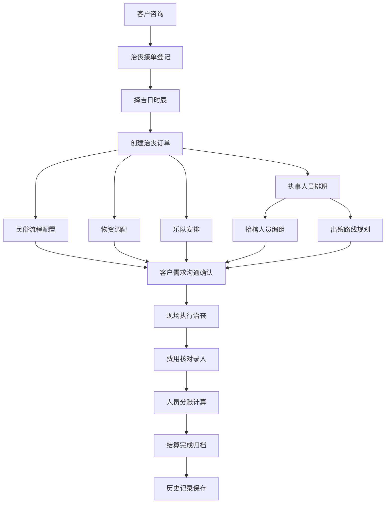

## 1. 产品概述

殡葬白事执事司仪团队Web管理系统，为民俗治丧团队提供一站式数字化管理平台。系统解决传统殡葬行业信息分散、排班混乱、物资难追溯、账目不清等痛点，覆盖从接单到结算全流程。

- 目标用户：殡葬服务公司、民俗治丧团队、白事司仪组织
- 核心价值：流程标准化、人员高效调度、物资精准管控、财务透明结算

## 2. 核心功能

### 2.1 用户角色

| 角色 | 说明 | 核心权限 |
|------|------|----------|
| 团队管理员 | 团队负责人/老板 | 全部功能权限、财务审批、人员管理 |
| 执事司仪 | 现场执行人员 | 查看排班、流程模板、物资申领 |
| 财务人员 | 负责结算分账 | 费用录入、分账计算、报表导出 |

### 2.2 功能模块

1. **治丧接单**：白事接单登记、逝者信息、家属信息、择吉日时辰、历史记录
2. **执事排班**：执事人员管理、排班调度、抬棺人员安排、出殡路线
3. **民俗流程**：各地民俗流程模板、步骤管理、自定义流程配置
4. **物资管理**：孝服纸扎物资、库存管理、出入库记录、物资盘点
5. **乐队安排**：唢呐乐队管理、曲目配置、演出时间安排
6. **客户沟通**：客户需求沟通记录、跟进提醒、需求变更
7. **结算分账**：各项费用管理、人员分账、收支明细、财务报表

### 2.3 页面详情

| 页面名称 | 模块名称 | 功能描述 |
|-----------|-------------|---------------------|
| 治丧接单 | 接单登记表单 | 逝者姓名/性别/年龄、生卒时间、家属联系人、家庭住址、治丧规格选择 |
| 治丧接单 | 择吉日时辰 | 黄历择日、出殡时辰选择、法事时辰安排 |
| 治丧接单 | 历史记录列表 | 历史治丧档案、搜索筛选、详情查看 |
| 执事排班 | 人员管理 | 执事人员档案（姓名/角色/电话/技能）、增删改查 |
| 执事排班 | 排班日历 | 日历视图展示排班、拖拽调整班次、冲突检测 |
| 执事排班 | 抬棺安排 | 抬棺人员编组、位置分配、备用人员 |
| 执事排班 | 出殡路线 | 路线地图标注、途经点、时间节点 |
| 民俗流程 | 模板列表 | 按地区分类的民俗流程模板、模板预览 |
| 民俗流程 | 流程步骤 | 步骤时序、执行要点、注意事项、负责人 |
| 民俗流程 | 自定义流程 | 新建/编辑模板、步骤拖拽排序 |
| 物资管理 | 物资档案 | 孝服/纸扎/香烛等分类、规格、单价、图片 |
| 物资管理 | 库存管理 | 实时库存、低库存预警、入库出库操作 |
| 物资管理 | 物资清单 | 每单物资配给、领用归还记录 |
| 乐队安排 | 乐队管理 | 唢呐乐队成员、乐器配置、等级划分 |
| 乐队安排 | 排班计划 | 演出场次、时间地点、曲目列表 |
| 客户沟通 | 沟通记录 | 时间线记录、沟通方式、关键内容、附件 |
| 客户沟通 | 需求跟进 | 待办提醒、需求变更记录、客户确认 |
| 结算分账 | 费用明细 | 服务费/物资费/乐队费等分类统计 |
| 结算分账 | 人员分账 | 按角色/工时/提成规则自动计算分账 |
| 结算分账 | 财务报表 | 收支汇总、利润分析、导出Excel |

## 3. 核心流程

## 4. 用户界面设计

### 4.1 设计风格

殡葬行业特殊性决定设计风格需庄重肃穆，同时兼顾现代管理系统的高效易用：

- **主色调**：深墨黑 (#1a1a1a) 为主，搭配素白 (#f8f8f8) 背景
- **辅助色**：沉香灰 (#6b6b6b)、亚麻蓝 (#4a6fa5) 用于功能强调
- **点缀色**：暗金 (#b8860b) 用于重要按钮和数据高亮，体现传统庄重感
- **按钮风格**：圆角 6px，扁平微阴影，hover 时轻微上浮
- **字体**：标题使用「思源宋体」体现传统感，正文使用「思源黑体」保证可读性
- **布局风格**：左侧导航 + 顶部工具栏 + 内容区卡片式布局
- **图标风格**：Lucide 线性图标，统一 20px 尺寸，描边 1.5px

### 4.2 页面设计概述

| 页面名称 | 模块名称 | UI元素 |
|-----------|-------------|-------------|
| 治丧接单 | 登记表单 | 双列表单布局、日期时间选择器、地区选择下拉、附件上传区 |
| 治丧接单 | 历史记录 | 搜索栏 + 筛选标签 + 数据表格 + 状态徽章 + 分页器 |
| 执事排班 | 排班日历 | 月/周视图切换、彩色时间块、拖拽把手、冲突红色标记 |
| 执事排班 | 人员卡片 | 头像 + 姓名角色标签 + 联系方式 + 技能徽章 + 状态灯 |
| 民俗流程 | 时间轴 | 垂直时间轴、步骤节点圆点、连接线、可折叠详情面板 |
| 物资管理 | 物资卡片 | 图片缩略图 + 名称分类 + 库存数量条 + 预警红点 + 操作按钮 |
| 乐队安排 | 排班表 | 甘特图样式时间轴、乐队分组、曲目标签 |
| 客户沟通 | 时间线 | 头像 + 时间戳 + 气泡消息框 + 附件卡片 |
| 结算分账 | 分账面板 | 人员列表 + 金额输入 + 计算结果卡片 + 进度条比例展示 |

### 4.3 响应式设计

- 桌面端优先设计（1280px 以上最佳体验）
- 平板端：左侧导航折叠为图标模式，内容区自适应
- 移动端：底部 Tab 导航，卡片单列布局，表单纵向堆叠
- 触控优化：按钮最小高度 44px，表格横向滚动支持

### 4.4 视觉细节

- 整体采用「新中式」美学，融入传统云纹暗纹作为页面背景装饰
- 数据卡片采用素白色底 + 1px 浅灰边框 + 8px 圆角
- 重要数据使用暗金色高亮，配合传统印章风格的状态标记
- 页面过渡动画：淡入 + 轻微位移，时长 200ms，缓动 ease-out
- 表格斑马纹采用极浅灰色，保持干净素雅
