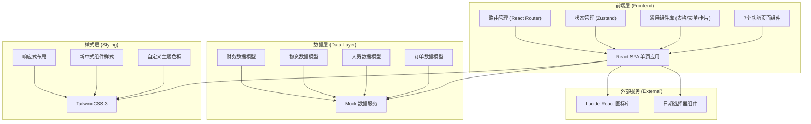
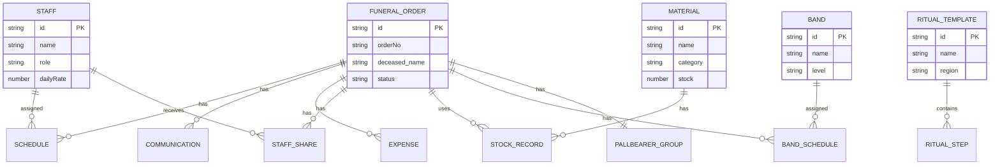

## 1. 架构设计



## 2. 技术描述

- **前端框架**：React@18 + TypeScript + Vite@5
- **初始化工具**：vite-init (react-ts 模板)
- **路由管理**：react-router-dom@6
- **状态管理**：zustand@4
- **样式方案**：tailwindcss@3 + PostCSS
- **图标库**：lucide-react@latest
- **后端**：无后端，使用 Mock 数据 + localStorage 持久化
- **数据存储**：浏览器 localStorage + 内存状态管理

## 3. 路由定义

| Route 路径 | 页面组件 | 功能说明 |
|------------|----------|----------|
| / | Dashboard | 首页仪表板，数据概览 |
| /orders | OrderList | 治丧接单 - 接单登记与历史记录 |
| /orders/new | OrderCreate | 治丧接单 - 新建接单表单 |
| /scheduling | Scheduling | 执事排班 - 排班日历与人员管理 |
| /scheduling/staff | StaffManage | 执事排班 - 执事人员档案管理 |
| /rituals | RitualTemplates | 民俗流程 - 流程模板列表 |
| /rituals/:id | RitualDetail | 民俗流程 - 模板详情与步骤 |
| /materials | MaterialManage | 物资管理 - 孝服纸扎物资管理 |
| /materials/inventory | Inventory | 物资管理 - 库存与出入库 |
| /band | BandSchedule | 乐队安排 - 唢呐乐队排班 |
| /communication | Communication | 客户沟通 - 沟通记录与需求跟进 |
| /settlement | Settlement | 结算分账 - 费用与人员分账 |
| /settlement/reports | Reports | 结算分账 - 财务报表 |

## 4. 数据模型定义

### 4.1 类型定义 (TypeScript)

```typescript
// 治丧订单
interface FuneralOrder {
  id: string;
  orderNo: string;
  deceased: {
    name: string;
    gender: 'male' | 'female';
    age: number;
    birthDate: string;
    deathDate: string;
    deathPlace: string;
  };
  family: {
    contactName: string;
    relationship: string;
    phone: string;
    address: string;
  };
  funeralSpec: 'standard' | 'deluxe' | 'premium';
  auspiciousDates: {
    funeralDate: string;
    funeralTime: string;
    ritualTimes: string[];
  };
  route?: RoutePoint[];
  status: 'pending' | 'scheduled' | 'in-progress' | 'completed' | 'cancelled';
  createdAt: string;
  remarks?: string;
}

// 执事人员
interface Staff {
  id: string;
  name: string;
  role: '司仪' | '执事' | '抬棺' | '法事' | '后勤' | '乐队';
  phone: string;
  skills: string[];
  status: 'available' | 'busy' | 'leave';
  avatar?: string;
  dailyRate: number;
}

// 排班记录
interface Schedule {
  id: string;
  orderId: string;
  staffId: string;
  date: string;
  shift: 'morning' | 'afternoon' | 'night' | 'full';
  task: string;
  position?: string;
}

// 抬棺编组
interface PallbearerGroup {
  orderId: string;
  mainBearers: string[];
  backupBearers: string[];
  positions: { [staffId: string]: string };
}

// 出殡路线
interface RoutePoint {
  name: string;
  address: string;
  arriveTime?: string;
  leaveTime?: string;
  notes?: string;
}

// 民俗流程模板
interface RitualTemplate {
  id: string;
  name: string;
  region: string;
  description: string;
  steps: RitualStep[];
}

interface RitualStep {
  id: string;
  order: number;
  title: string;
  duration: number;
  description: string;
  notes: string;
  responsibleRole: string;
}

// 物资
interface Material {
  id: string;
  name: string;
  category: '孝服' | '纸扎' | '香烛' | '鲜花' | '其他';
  spec: string;
  unit: string;
  price: number;
  stock: number;
  minStock: number;
  image?: string;
}

// 出入库记录
interface StockRecord {
  id: string;
  materialId: string;
  type: 'in' | 'out';
  quantity: number;
  orderId?: string;
  operator: string;
  date: string;
  notes?: string;
}

// 乐队
interface Band {
  id: string;
  name: string;
  leader: string;
  members: BandMember[];
  level: '普通' | '资深' | '金牌';
  fee: number;
}

interface BandMember {
  id: string;
  name: string;
  instrument: string;
  phone: string;
}

interface BandSchedule {
  id: string;
  orderId: string;
  bandId: string;
  date: string;
  timeSlot: string;
  location: string;
  setlist: string[];
}

// 沟通记录
interface Communication {
  id: string;
  orderId: string;
  date: string;
  method: '电话' | '微信' | '面谈';
  content: string;
  operator: string;
  attachments?: string[];
  followUp?: string;
}

// 费用明细
interface Expense {
  id: string;
  orderId: string;
  category: '服务费' | '物资费' | '乐队费' | '场地费' | '其他';
  item: string;
  amount: number;
  paid: boolean;
}

// 人员分账
interface StaffShare {
  id: string;
  orderId: string;
  staffId: string;
  baseAmount: number;
  bonus: number;
  total: number;
  settled: boolean;
}
```

### 4.2 数据模型 ER 图



## 5. 项目目录结构

```
c:\trae-bz\TraeProjects\30018
├── src/
│   ├── components/          # 通用组件
│   │   ├── Layout/         # 布局组件 (Sidebar, Header)
│   │   ├── ui/             # 基础UI组件 (Card, Button, Modal, Table)
│   │   └── shared/         # 业务通用组件 (StatusBadge, StaffCard)
│   ├── pages/              # 页面组件
│   │   ├── Dashboard.tsx
│   │   ├── orders/         # 治丧接单
│   │   ├── scheduling/     # 执事排班
│   │   ├── rituals/        # 民俗流程
│   │   ├── materials/      # 物资管理
│   │   ├── band/           # 乐队安排
│   │   ├── communication/  # 客户沟通
│   │   └── settlement/     # 结算分账
│   ├── store/              # Zustand 状态管理
│   │   ├── useOrderStore.ts
│   │   ├── useStaffStore.ts
│   │   ├── useMaterialStore.ts
│   │   └── useFinanceStore.ts
│   ├── types/              # TypeScript 类型定义
│   │   └── index.ts
│   ├── data/               # Mock 数据
│   │   ├── mockOrders.ts
│   │   ├── mockStaff.ts
│   │   ├── mockMaterials.ts
│   │   └── mockRituals.ts
│   ├── utils/              # 工具函数
│   │   ├── dateUtils.ts
│   │   ├── calcUtils.ts
│   │   └── storage.ts
│   ├── App.tsx
│   ├── main.tsx
│   └── index.css
├── .trae/
│   └── documents/
├── package.json
├── vite.config.ts
├── tsconfig.json
├── tailwind.config.js
└── postcss.config.js
```
